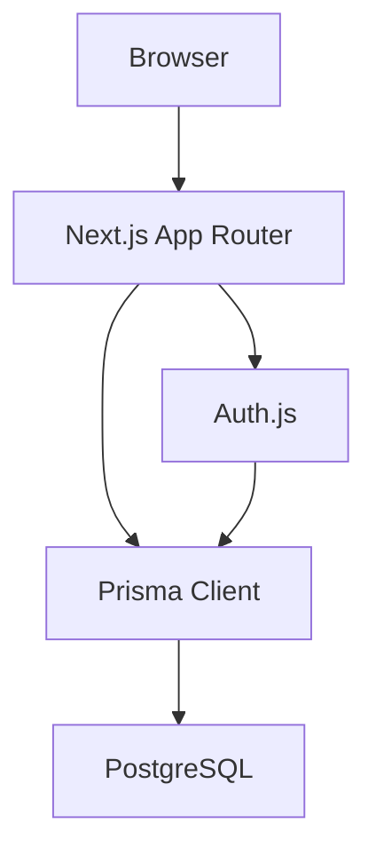

# ApplyFlow Architecture

## System overview



ApplyFlow is one deployable Next.js application. PostgreSQL is the source of truth, and Prisma uses the `DATABASE_URL` environment variable through `prisma.config.ts` and the PostgreSQL driver adapter.

## Rendering and interaction

- Server Components load authenticated application, board, and analytics data.
- Client Components are limited to interactive concerns such as forms, drag-and-drop, mobile navigation, and Recharts.
- Server Actions perform creates, edits, deletes, and status changes.
- Loading and error boundaries follow the App Router route hierarchy.

## Authentication and authorization

Auth.js uses GitHub OAuth, the Prisma Adapter, and database-backed sessions. `proxy.ts` provides coarse protection for private route families. Business security does not rely on the proxy: `requireUser()` validates the server-side session, and private Prisma queries always include the authenticated `userId`.

Application detail, edit, delete, and status mutations first query by both application ID and user ID. A foreign or missing ID produces the same not-found behavior, preventing IDOR information disclosure. The client never supplies an authoritative user ID.

## Domain model

```text
User
 |--< Account
 |--< Session
 |--< Company
 |     |--< Application
 |     |--< Contact
 |
 |--< Application
       |--< Contact
       |--< ApplicationEvent
```

Applications move through `SAVED`, `APPLIED`, `SCREENING`, `INTERVIEW`, `OFFER`, `REJECTED`, and `WITHDRAWN`. Status updates create append-only `STATUS_CHANGED` events. Detail edits create `APPLICATION_UPDATED` events.

## Board and analytics

The board loads a minimal user-scoped projection on the server. Native drag-and-drop and a keyboard/touch-friendly status select call the same authorized status action.

Analytics uses user-scoped Prisma counts, grouping, and targeted selects. Only aggregated chart data reaches the client. The dashboard intentionally avoids historical conversion rates that cannot be derived reliably from the current structured model.

## Deployment

The runtime requires Node.js 22+, environment-based Auth.js secrets, and a PostgreSQL connection string. Local development can use Docker Compose; production can use hosted PostgreSQL such as Supabase and a Next.js host such as Vercel. Database migrations are applied explicitly with `prisma migrate deploy` and are never run by the CI build.
